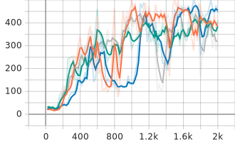
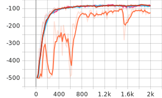
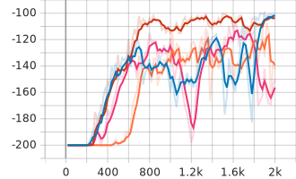

Deep Q-network (DQN) and Its Variants
==============

DQN is a reinforcement learning algorithm that combines deep learning techniques with Q-learning, a classic reinforcement learning algorithm. DQN was introduced by Google DeepMind in 2013 and has since become one of the foundational algorithms in the field of deep reinforcement learning.   

DQN has demonstrated impressive results in various domains, including Atari 2600 games, robotics control, and board games. It laid the foundation for subsequent advancements in deep reinforcement learning and paved the way for more sophisticated algorithms like Double DQN (DDQN), Dueling DQN, and Rainbow DQN.

Python Module Requirements
-----

* gym >= 0.21.0
* tensorboard >= 2.12.3

Details
-----

### 1. Discrete State and Action Environments

* CartPole-v1, Acrobot-v1, MountainCar-v0

### 2. Usable Types of DQN

* DQN, Double-DQN (DDQN), Dueling-DQN, Dueling Double-DQN (D3QN)

### 3. Additional Techniques

* Reward Clipping, Soft target update, Prioritized replay buffer (PER)

How to use (Run Examples)
-----

* **Vanilla DQN** (vanilla DQN, hard target update, CartPole-v1)

    ``python dqn_family.py``

* D3QN with soft target update and PER in Acrobot-v1 environment

    ``python dqn_family.py --env Acrobot-v1 --network_type=d3qn --use_soft_update --use_per``

* **Best performance** model in all environments (DDQN, soft target update)

    ``python dqn_family.py --env CartPole-v1 --network_type=ddqn --use_soft_update``   
    ``python dqn_family.py --env Acrobot-v1 --network_type=ddqn --use_soft_update``   
    ``python dqn_family.py --env MountainCar-v0 --network_type=ddqn --use_soft_update``

* Implement Tensorboard

    ``tensorboard --logdir=runs/{$env_name}``

Experiment Results
-----

* The average score curves of vanilla DQN and its variants in the other CartPole-v1, Acrobot-v1, MountainCar-v0   
    

        
        
        
    

Reference
-----

### Paper Reference

[1] DQN: Volodymyr Mnih, Koray Kavukcuoglu, David Silver, Andrei A Rusu, Joel Veness, Marc G Belle-mare, Alex Graves, Martin Riedmiller, Andreas K Fidjeland, Georg Ostrovski, et al. Human-level control through deep reinforcement learning. nature, 518(7540):529–533, 2015.   
[2] Double-DQN: Hado Van Hasselt, Arthur Guez, and David Silver. Deep reinforcement learning with double q-learning. In Proceedings of the AAAI conference on artificial intelligence, volume 30, 2016.   
[3] Dueling-DQN: Ziyu Wang, Tom Schaul, Matteo Hessel, Hado Hasselt, Marc Lanctot, and Nando Freitas. Dueling network architectures for deep reinforcement learning. In International conference on machine learning, pages 1995–2003. PMLR, 2016.   
[4] Prioritized Replay Buffer (PER): Tom Schaul, John Quan, Ioannis Antonoglou, and David Silver. Prioritized experience replay. arXiv preprint arXiv:1511.05952, 2015.   
[5] Soft Target Update, DDPG: Timothy P Lillicrap, Jonathan J Hunt, Alexander Pritzel, Nicolas Heess, Tom Erez, Yuval Tassa, David Silver, and Daan Wierstra. Continuous control with deep reinforcement learning. arXiv preprint arXiv:1509.02971, 2015.  

### Code Reference

[1] https://github.com/keep9oing/DQN-Family  
[2] https://github.com/openai/baselines/blob/master/baselines/common/segment_tree.py  
[3] https://github.com/seungeunrho